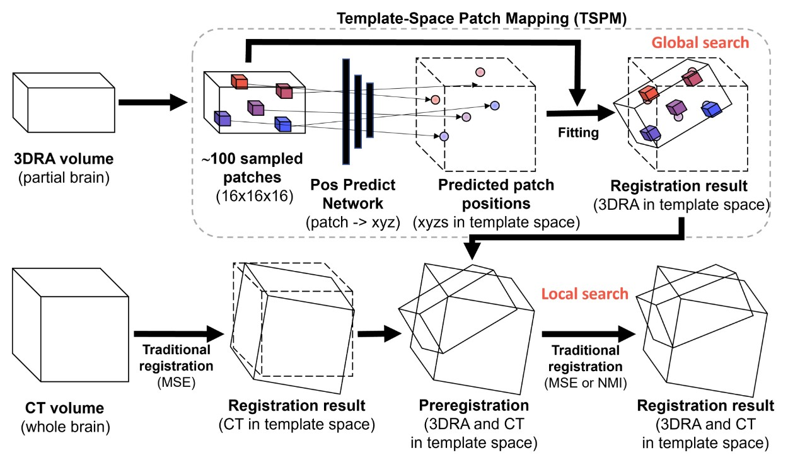

# Data-driven Multi-Modal Partial Medical Image Preregistration by Template Space Patch Mapping (MICCAI 2022)

Our paper introduces a template-space patch mapping (TSPM) method providing reliable initialization for local-search registration in rigid multi-modal partial image registration. 
Instead of matching two images directly, we register the two images to a common template space using a pre-trained neural network. We use patch-based mapping to handle images of diverse sizes and a RANSAC-based fitting algorithm to remove outliers. The network is trained with manually registered images. We then run traditional local search registration on the given initialization to obtain the final registration result.

## Data
For data, we will release limited desensitized data. It is difficult to release the entire dataset soon due to ethical concerns (raw scan data might leak face geometry). We will keep efforts to prepare public dataset, but it takes time (get consent from patients).

## Train
For preprocessing data into patches, please find the code in `preprocess` by running
```
python preprocess/one_step_prepare.py
```

You could find all codes related in folder `train_init_model`. To train the model, just run the following command
```
python train_init_model/train.py
```
Please remember to change the source of data before experiments.

## Evaluate
In `exec_pipeline`, you could find codes for our method (`DL_pipeline.py`) and center-init method (`Ori_pipeline.py`)
You could test our code by running
```
python exec_pipeline/DL_pipeline.py
python exec_pipeline/Ori_pipeline.py
```
Please remember to change the data you want to test in these codes.

## Modification to Libraries
You could find modified libraries in `basic_utils/import_util_libs`
We will add detailed explanation for modification later.

## Extra Experiments
We will add extra experiments result in this part later.